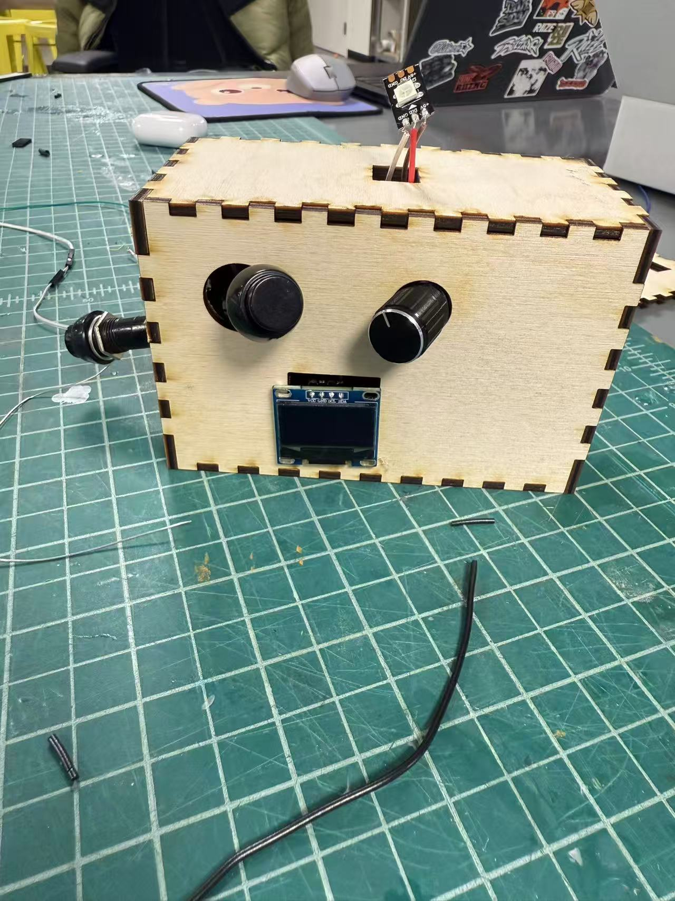

📘 Bop-It Style Handheld Game (ESP32-C3 + CircuitPython)

A 90s-style handheld electronic reaction game inspired by Bop It and Brain Warp, built with an ESP32-C3, SSD1306 OLED, ADXL345 accelerometer, rotary encoder, push button, NeoPixel, LiPo battery, and a custom wooden enclosure.

This project demonstrates real-time embedded game logic, sensor fusion, input processing, and hardware integration as part of an embedded systems course.

🎮 How to Play

Power on the device using the back-mounted toggle switch.

Use the rotary encoder to scroll through the three difficulty modes:

Easy (long timer)

Medium

Hard (short timer)

Press the main action button to confirm difficulty and start the game.

Each level, the OLED displays a random move:

TURN LEFT → rotate encoder CCW

TURN RIGHT → rotate encoder CW

SHAKE → shake the whole device

PRESS BTN → press the main action button

Perform the move before the timer expires.

✔ Correct → next level
✖ Wrong OR timeout → Game Over
🔁 Press button to restart without turning power off
🏆 Clear all 10 levels → YOU WIN!

The NeoPixel LED provides visual cues for game states (start, level change, win, game over).

🧩 Components Used
Microcontroller

Seeed Studio XIAO ESP32-C3 running CircuitPython

Inputs

Rotary Encoder (A/B channels)

External Push Button

ADXL345 Accelerometer (shake detection)

Outputs

SSD1306 128×64 OLED Display

WS2812 NeoPixel RGB LED

Power

LiPo Battery

Physical On/Off Toggle Switch

Battery connected to ESP32-C3 BAT pin (not USB-powered)

Enclosure

Custom laser-cut wood box

Cutouts for encoder, button, USB-C, and LCD window

Removable lid for access to electronics

🧠 System Block Diagram

🔌 Circuit Diagram

Full KiCad schematic exported as PDF:

📄 bopit_circuit.pdf

Includes wiring for:

I²C bus (OLED + ADXL345)

Rotary encoder A/B input channels

External button (digital input with internal pull-up)

NeoPixel data + 3.3V power

Battery + switch power path

ESP32-C3 pin assignments

📐 Enclosure

Example of the finished enclosure:

Designed to:

Protect internal electronics

Provide stable mounting for encoder/button

Allow USB-C access

Enable easy assembly and maintenance

🗂️ Repository Structure
bopit-game/
│
├── code/
│   └── code.py              # Main CircuitPython game logic
│
├── lib/                     # CircuitPython libraries
│
├── docs/
│   ├── system_diagram.png   # System block diagram
│   ├── bopit_circuit.pdf    # Circuit schematic
│   ├── Enclosure.png        # Enclosure photo
│   └── bopit_circuit/       # KiCad project files
│
└── README.md

🚀 How to Run the Game

Install CircuitPython on the Seeed Studio XIAO ESP32-C3.

Copy the following to the CIRCUITPY USB drive:

code/code.py

lib/ folder with required libraries

Disconnect USB.

Power the device using the LiPo battery.

Flip the toggle switch → Game Starts!

✔️ Features Checklist (Matches Course Requirements)
Requirement	Status
Three difficulty settings	✔
Four unique player moves	✔
Time-limited input	✔
Ten levels	✔
OLED shows current move + level	✔
Game Over screen	✔
Restart without power cycling	✔
Win screen	✔ (rainbow NeoPixel animation)
Accelerometer filtering/calibration	✔
NeoPixel integrated into gameplay	✔
Proper battery + switch wiring	✔
Circuit diagram	✔
System block diagram	✔
Enclosure	✔
Clean, organized GitHub repo	✔
